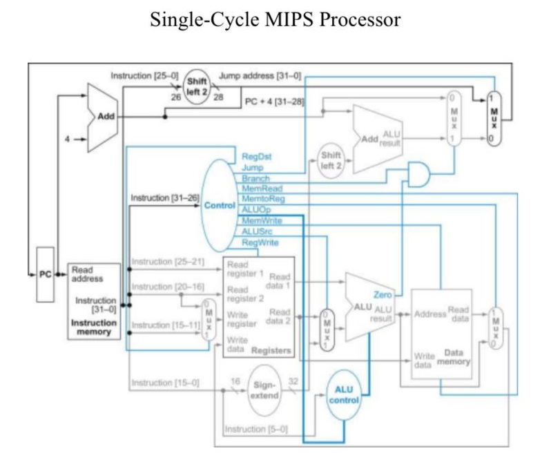
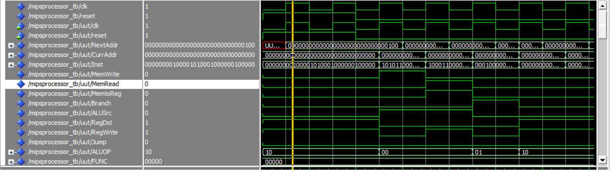
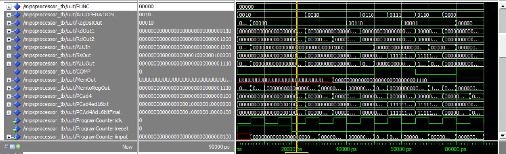
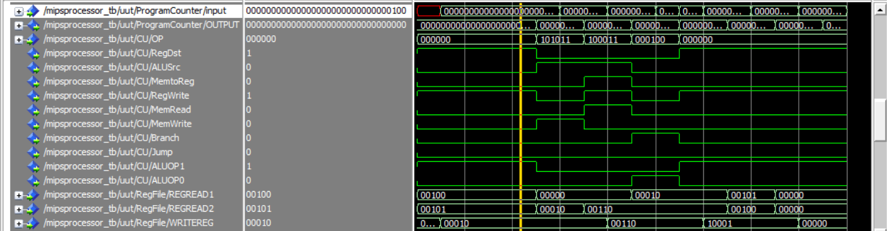
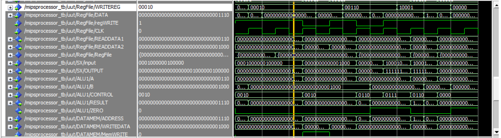
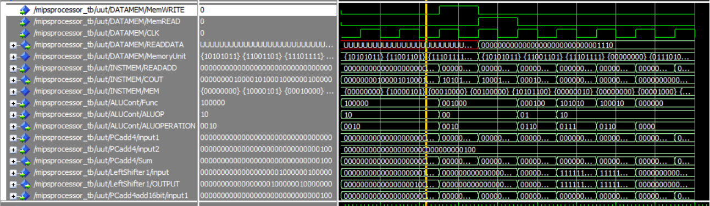

# MIPS Single-Cycle Processor

This repository contains the VHDL implementation of a simplified single-cycle MIPS processor. The project demonstrates the execution of basic MIPS instructions and includes simulation waveforms for verification.

---

## Features

- **Core MIPS instructions implemented:**
  - `add`
  - `sub`
  - `lw`
  - `sw`
  - `beq`
  - `slt`
- **Components include:**
  - Instruction Memory
  - Data Memory
  - Register File
  - ALU
  - Control Unit
- **Simplifications:**
  - Instruction memory size: 32 bytes
  - Data memory size: 64 bytes

---

## Memory Contents and Register File

### Initial Register File:
| Register | Value |
|----------|-------|
| `$a0`    | `6`   |
| `$a1`    | `8`   |

### Initial Data Memory:
| Address    | Value         |
|------------|---------------|
| Memory[0]  | `0xABCDEF00`  |
| Memory[1]  | `0x75746572`  |
| Memory[2]  | `0x20417263`  |
| Memory[3]  | `0x68697465`  |
| Memory[4]  | `0x12345678`  |
| Memory[5]  | `0x7F7F6D6D`  |
| Memory[6]  | `0x00000000`  |
| Memory[7]  | `0x78786A6A`  |
| Memory[8]  | `0x00000001`  |

### Program Loaded in Instruction Memory:
1. `add $v0, $a0, $a1`
2. `sw $v0, 8($zero)`
3. `lw $a2, 8($zero)`
4. `beq $v0, $a2`
5. `slt $s1, $v0, $a2`
6. `sub $s1, $a1, $a0`

---

## Directory Structure

```
MIPS_Single_Cycle/
|-- images/
|   |-- single_cycle_data_path.png  # Single-cycle data path diagram
|   |-- SS1.png                     # Waveform screenshot 1
|   |-- SS2.png                     # Waveform screenshot 2
|   |-- SS3.png                     # Waveform screenshot 3
|   |-- SS4.png                     # Waveform screenshot 4
|   |-- SS5.png                     # Waveform screenshot 5
|-- MIPS/                            # VHDL source files
|-- README.md                       # Project documentation
```

---

## Single-Cycle Data Path


---

## Simulation Waveforms

### Screenshot 1:


### Screenshot 2:


### Screenshot 3:


### Screenshot 4:


### Screenshot 5:


---

## Notes
1. The instruction memory is limited to 32 bytes for simplicity.
2. The data memory is limited to 64 bytes for simplicity.
3. The register file, memory contents, and program loaded into the instruction memory are described above.

---


